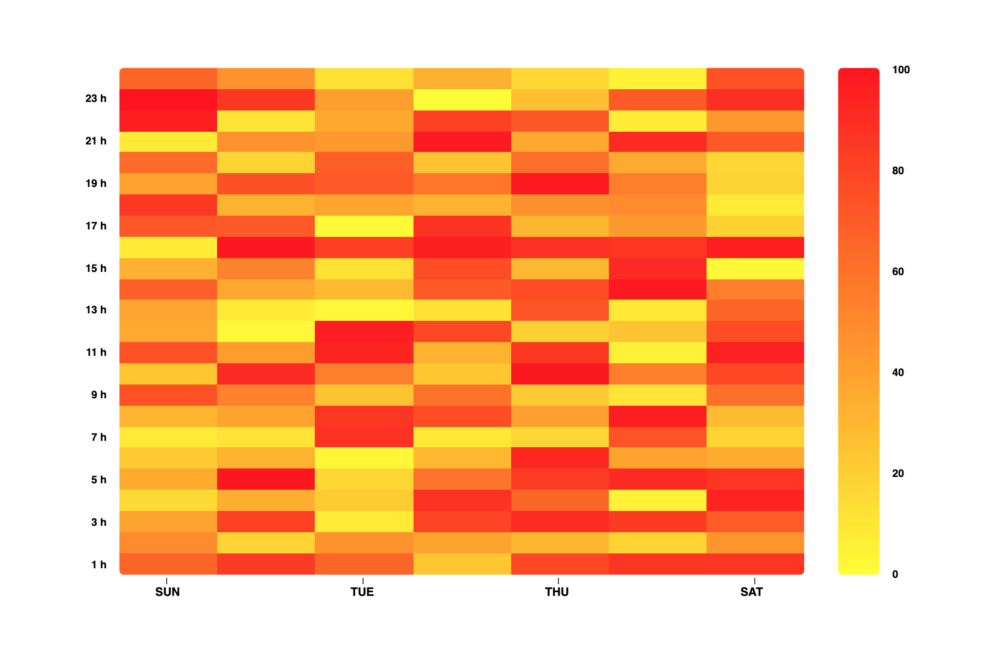

# react-simple-heatmap

> A simple React component to create responsive heatmap. To be rendered, this heatmap only need a dataset (2D Array) and a parent element which have a width and height. There is more customization available.

[](https://www.npmjs.com/package/react-simple-heatmap) [](https://standardjs.com)


## Install

```bash
yarn add react-simple-heatmap
```
or
```bash
npm install react-simple-heatmap
```




## Demo
[Here is a simple preview.](https://react-simple-heatmap.firebaseapp.com/)


## Obligatory Fields
| Name | Type |  description | example | default |
|--|--|--|--|--|
| data | 2D Array of numbers | 2D Matrix of numbres | [[10,12,33], [2,45,31], [16, 32, 29]] | undefined |


#### Basic Example:
```jsx
import React, { Component } from "react"
import Heatmap from "react-simple-heatmap"

export default class App extends Component {

  render() {
    // 2D array of numbers
    const data = [[10, 12, 33],
                  [21, 45, 31],
                  [16, 32, 29]];
    return (
      <div
        style={{ height: "500px", width: "500px" }}>
        <Heatmap
          data={ data }
        />
      </div>
    );
  }
}
```


## Customization fields
| Name | Type |  description | example | default |
|--|--|---|--|--|
| bgColors | Array of 2 colors | Main color using `RGB` format | `["rgb(255, 11, 11)", "rgb(255, 255, 0)"]` | `["rgb(24, 144, 255)", "rgb(255, 255, 255)"]` |
| xLabels | Array | Display the X-axis labels | `["SUN", "MON", "TUE", "WED", "THU", "FRI", "SAT"]` | `undefined` |
| yLabels | Array | Display the Y-axis labels | `[1,2,3,4,5,6,7,8,9,10]` | `undefined` |
| showLegend | Bollean | Display the heatmap legend.  | `true` | `false` |
| onClick | Function | Adding an handler to cell click | ```(data, x, y) => alert(`Data: ${ data }, X: ${ x }, Y: ${ y }\`)``` | `undefined` |
| showData | Bollean | Display data inside each cells.  | `true` | `false` |
| bordered | Bollean | Display a border on the heatmap.  | `false` | `true` |
| xStepLabel | Number | Show the label if his index in the xLabels array modulo xStepLabel equals 0 | `2` | `undefined` |
| yStepLabel | Number | Show the label if his index in the yLabels array modulo yStepLabel equals 0 | `2` | `undefined` |
| showTicks | Boolean or String | Show the ticks lines of the label. Use `true` to show X-axis and Y-axis ticks, `"y"` to show only Y-axis ticks and `"x"` to show only X-axis ticks.  | `"y"` | `false` |
| xLabelsStyle | Object | Style your X-axis labels. | `{ fontWeight: "bold" }` | {} |
| yLabelsStyle | Object | Style your Y-axis labels. | `{ fontWeight: "bold" }` | {} |
| legendStyle | Object | Style your Legeng labels. | `{ fontWeight: "bold" }` | {} |
| borderRadius | String | Add border radius to the heatmap and legend | `"4px"` | `0` |


#### Customization example

```jsx
import React, { Component } from 'react'
import Heatmap from 'react-simple-heatmap'

import './App.css';

// Creating a 10 x 10 array of random numbers
const size = 10;
const data = [];
for(let i = 0; i < size; i++){
  const temp = [];
  for(let i = 0; i < size; i++){
    temp.push(Math.round(Math.random() * 100) / 100);
  }
  data.push(temp);
}

export default class App extends Component {

  render() {
    return (
      <div style={{ marginTop: "4rem" }}>
        <div style={{ height: "500px", width: "500px" }}>
          <Heatmap
            showData={ true }
            showLegend={ true }
            bgColor={ "rgb(255, 17, 17)" }
            data={ data }
            onClick={ (data) => console.log(data) }
		  />
        </div>
      </div>
    );
  }
}
```


## License

MIT © [Julien Rioux](https://github.com/JulienRioux)
