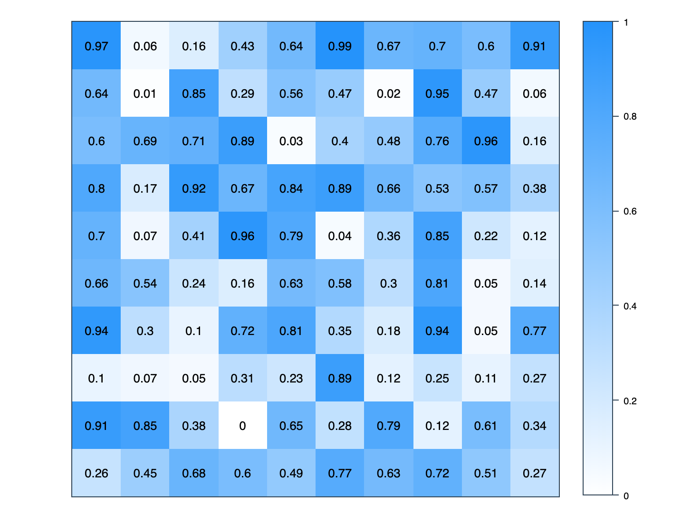

# react-simple-heatmap

> A simple React component to create responsive heatmap. The heatmap take the height and width of it's parent element.

[](https://www.npmjs.com/package/react-simple-heatmap) [](https://standardjs.com)

## Install

```bash
npm install react-simple-heatmap
```
or
```bash
yarn add react-simple-heatmap
```

## Properties
| Name | Type |  description | example | default | isRequired |
|--|--|--|--|--|--|
| data | 2D Array of numbers | 2D Matrix of numbres | [[10,12,33], [2,45,31], [16, 32, 29]] | undefined |  true |
| bgColor | String | Main color using RGB format | "rgb(255, 17, 17)" | "rgb(24, 144, 255)" | false |
| showLabels | Bollean | Display data inside each cells.  | true | false | false |
| onClick | Function | Adding an handler to cell click | (data) => console.log(data) | undefined | false |


## Usage

```jsx
import React, { Component } from "react"

import Heatmap from "react-simple-heatmap"

export default class App extends Component {

  render() {

    return (
      <div
        style={{ height: "500px", width: "500px" }}>
        <Heatmap
          data={ data }  // 2D array of numbers
        />
      </div>
    );
  }
}
```


## Example

```jsx
import React, { Component } from 'react'
import Heatmap from 'react-simple-heatmap'

import './App.css';

// Creating a 10 x 10 array of random numbers
const size = 10;
const data = [];
for(let i = 0; i < size; i++){
  const temp = [];
  for(let i = 0; i < size; i++){
    temp.push(Math.round(Math.random() * 100) / 100);
  }
  data.push(temp);
}

export default class App extends Component {

  render() {
    return (
      <div style={{ marginTop: "4rem" }}>
        <div style={{ height: "500px", width: "500px" }}>
          <Heatmap
            showLabels={ true }
            bgColor={ "rgb(255, 17, 17)" }
            data={ data }
            onClick={ (data) => console.log(data) }
					/>
        </div>
      </div>
    );
  }
}
```

## Screenshot



## License

MIT © [JulienRioux](https://github.com/JulienRioux)
